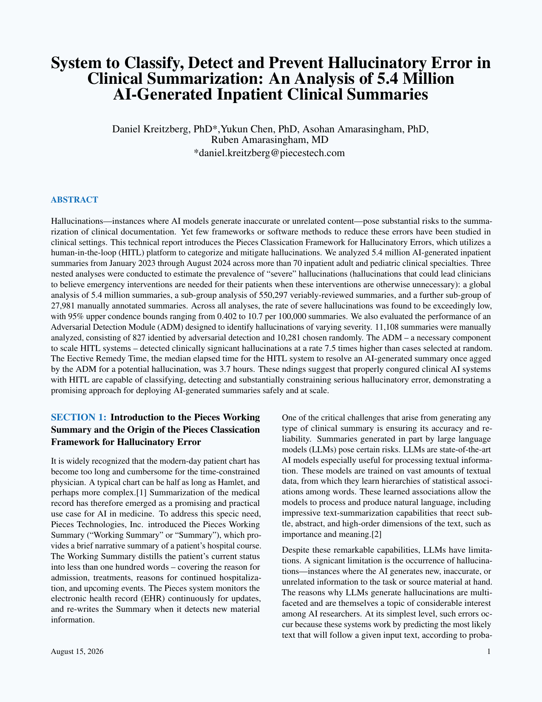

# Professional Two-Column LaTeX Template for Research Papers & Technical Reports

[](https://github.com/ashakeelee/Latex-template/actions/workflows/build-pdf.yml)

A professional, reusable two-column LaTeX article template for research papers, academic manuscripts, technical reports, white papers, and publication-ready documents. It includes custom styling, BibLaTeX references, full-width figures and tables, and an automated PDF build.

> Need a custom LaTeX or Overleaf template? **[Request a project quote](https://github.com/ashakeelee/Latex-template/issues/new?template=hire-me.yml)** for formatting, typesetting, template customization, or Word-to-LaTeX conversion.

## Compiled PDF preview



**[Download the latest PDF build](https://github.com/ashakeelee/Latex-template/actions/workflows/build-pdf.yml)** · **[Explore the LaTeX source](main.tex)** · **[Request custom work](https://github.com/ashakeelee/Latex-template/issues/new?template=hire-me.yml)**

GitHub cannot embed an interactive PDF inside a README, so page 1 is displayed as an image. The read-only build workflow compiles the complete PDF and preview whenever the LaTeX source, bibliography, styles, or figures change. Open the latest successful run and download the `latex-template` artifact.

## Hire me for LaTeX and Overleaf projects

I help researchers, students, engineers, technical teams, and businesses turn content into clean, consistent, publication-ready documents.

Services available:

- Custom LaTeX and Overleaf template design
- Research-paper and technical-report formatting
- Thesis, dissertation, journal, and conference formatting
- Word, Google Docs, or existing PDF conversion to LaTeX
- Equation, table, figure, citation, and bibliography cleanup
- Two-column layouts and reusable document-class customization
- Build automation and organized project handoff

Every project can include clean source files, a compiled PDF, reusable styles, and simple editing instructions. **[Open a project inquiry](https://github.com/ashakeelee/Latex-template/issues/new?template=hire-me.yml)** with your document type, approximate page count, deadline, and required format.

> Project inquiries are public GitHub issues. Do not include confidential, unpublished, personal, or proprietary content; share only a general project description.

## Suitable for

- Academic and scientific research papers
- Engineering and software technical reports
- AI, data science, and medical-research manuscripts
- Corporate white papers and professional reports
- Conference papers, preprints, and journal submissions
- Reusable Overleaf projects and organization-specific templates

## Template features

- Professional letter-size two-column article layout
- Custom title, abstract, section, caption, and bibliography styling
- Full-width figures and tables
- Technical appendix support
- BibLaTeX bibliography with numeric IEEE-style citations
- Automated PDF compilation with GitHub Actions
- Overleaf-compatible project structure

## Quick start

1. Download, fork, or clone this repository.
2. Edit the title, authors, abstract, and content in `main.tex`.
3. Add bibliography entries to `references.bib`.
4. Put images in `figure/` and custom formatting in `style/`.
5. Compile with a full TeX Live installation or upload the project to Overleaf.

### Compile locally

```bash
git clone https://github.com/ashakeelee/Latex-template.git
cd Latex-template
latexmk -pdf main.tex
```

### Use with Overleaf

Download the repository as a ZIP, create a new Overleaf project, upload the ZIP, and set `main.tex` as the main document.

## Project structure

```text
.
├── main.tex             # Main document
├── Appendix.tex         # Technical appendix
├── references.bib       # Bibliography
├── style/               # Custom class and styles
├── figure/              # Document figures
└── preview/              # Generated first-page preview
```

Created by Asma Shakeel.

Related topics: LaTeX research paper template, two-column article template, Overleaf template, academic typesetting, technical report formatting, BibLaTeX, IEEE-style references, scientific writing, and professional PDF design.
